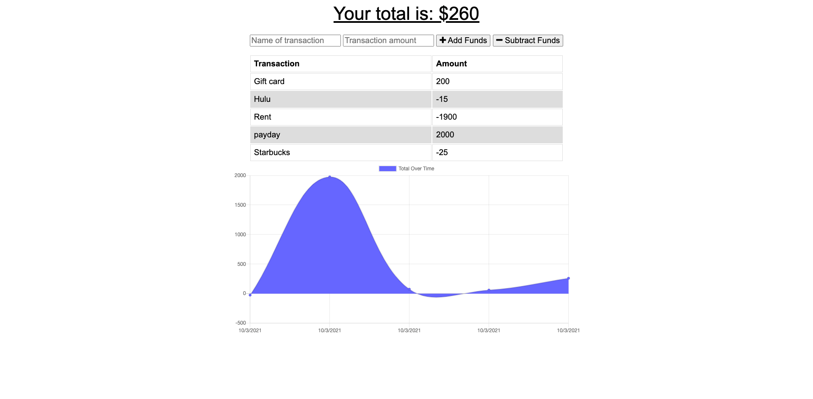

# Budgie: A Budget Budget Tracker 
Budgie: A Budget Tracker was already taken. This will be more affordable, hence the extra "Budget". This is a PWA designed to track a personal budget.

## Table of Contents
1. [Usage](#usage)
2. [License](#license)
3. [Questions](#questions)

## Usage
- Navigate to the deployed [Budgie Budget Budget Tracker](https://budgie-budget-budget-tracker.herokuapp.com).
- Input name of transaction and amount, and click +Add Funds or -Subtract Funds.
- Functionality will persist regardless of internet connection.

## License
This project is [MIT](https://opensource.org/licenses/MIT) licensed.

## Questions
Additional questions? Please contact me at sammn721@gmail.com! For more projects, please visit my [GitHub profile](https://github.com/sammn721).